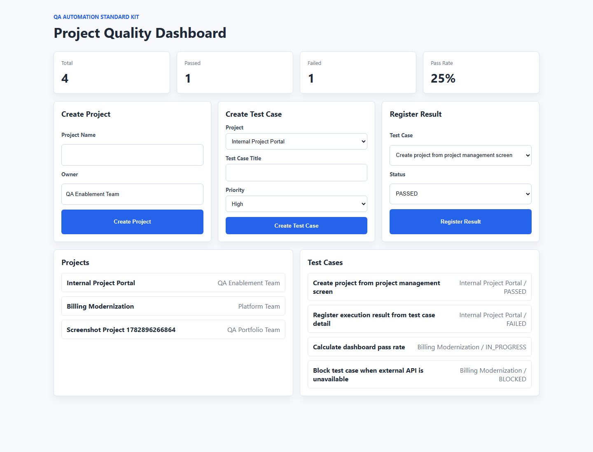
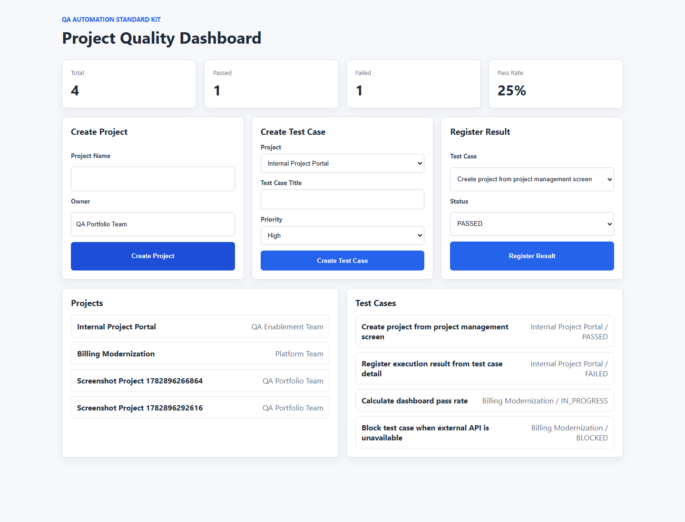
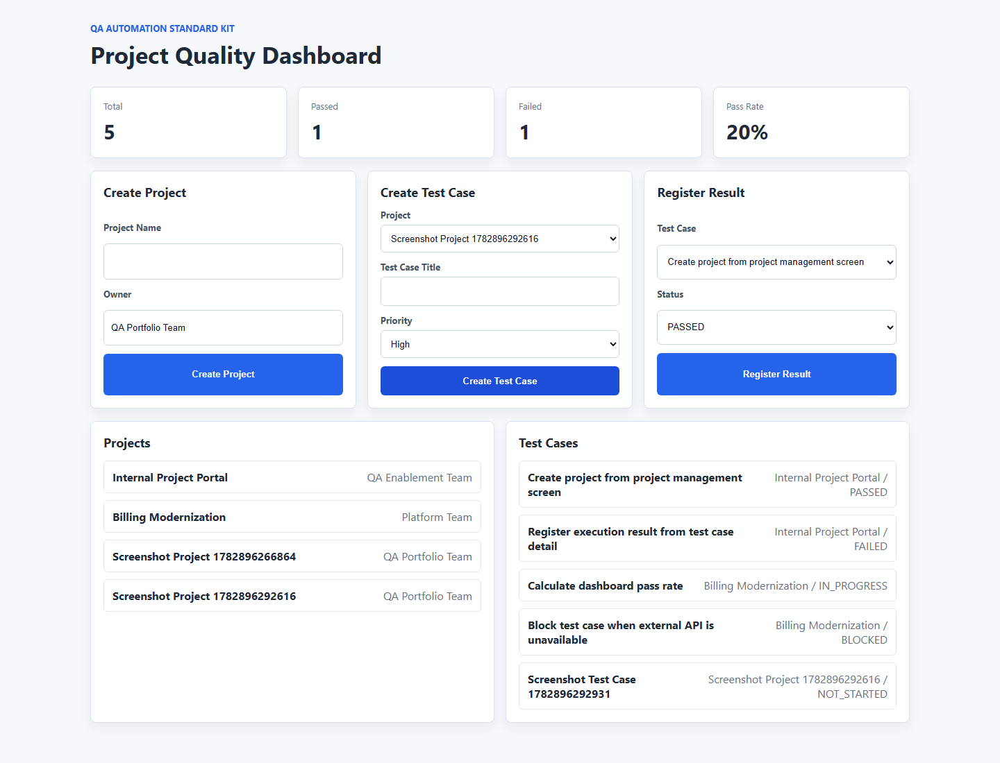
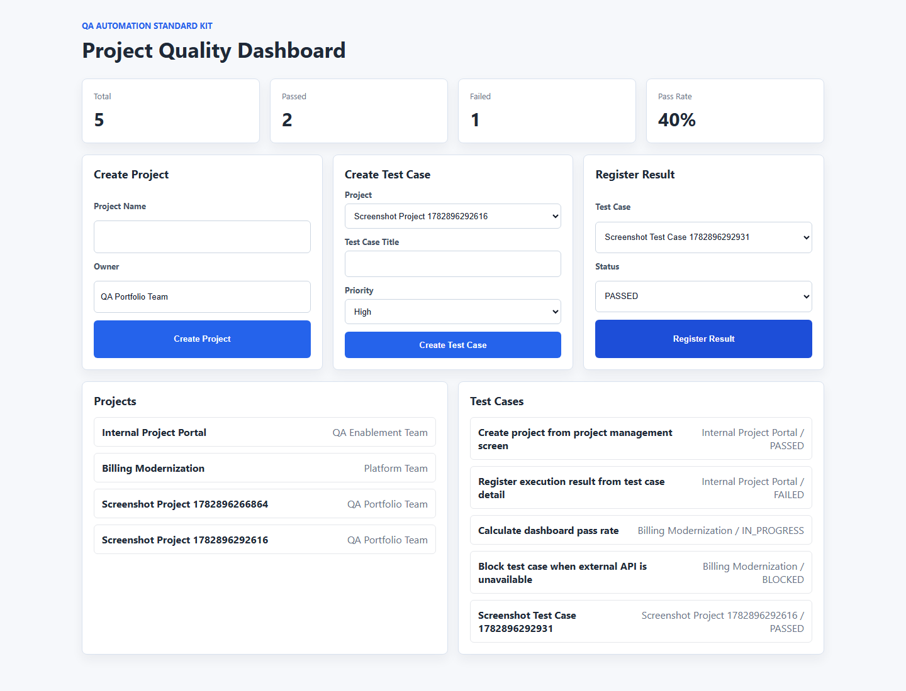
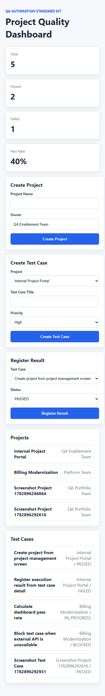

# QA Automation Standard Kit

`qa-automation-standard-kit` は、複数の社内プロジェクトへ横断導入できるテスト自動化スターターキットです。小規模なプロジェクト管理・品質管理Webアプリを題材に、Spring Boot API、React UI、Unit / Integration / API / E2E の自動テスト、CI/CD、テストレポート、社内展開用ドキュメントを一式でまとめています。

## このプロジェクトで再現している業務内容

社内のQA推進担当またはテスト自動化アーキテクトが、各開発チームに対して以下を標準提供する場面を想定しています。

- テスト自動化導入時のリファレンス実装
- REST API、画面、CIを含むテスト環境構築
- JUnit、Mockito、Spring Boot Test、Karate、Postman、Playwright、Selenium の使い分け例
- テストケース、テスト実行結果、ステータス、品質ダッシュボードの管理
- 開発チームへ共有するガイドライン、テスト戦略、ツール選定、オンボーディング資料

## ディレクトリ構成

```text
qa-automation-standard-kit/
  backend/                 # Java 17 / Spring Boot 3 REST API
  frontend/                # TypeScript / React / Vite UI
  tests/
    karate/                # Karate API test
    postman/               # Postman collection
    playwright/            # Playwright E2E test
    selenium/              # Selenium WebDriver sample
  docs/                    # 社内標準化向け資料
  .github/workflows/       # GitHub Actions CI
  docker-compose.yml
  run-local-tests.ps1
```

## 使用技術スタック

| 領域 | 技術 |
| --- | --- |
| Backend | Java 17, Spring Boot 3, Spring Web, Spring Validation, Spring Data JPA, H2, Maven |
| Frontend | TypeScript, React, Vite, Axios |
| Unit Test | JUnit 5, Mockito |
| Integration Test | Spring Boot Test, MockMvc, DataJpaTest |
| API Test | Karate, Postman Collection |
| E2E Test | Playwright, Selenium WebDriver |
| DevOps | Docker, docker-compose, GitHub Actions |

## アプリ機能

- プロジェクト一覧、登録、更新、削除
- テストケース一覧、登録、更新、削除
- テスト実行結果登録
- テストステータス管理: `NOT_STARTED`, `IN_PROGRESS`, `PASSED`, `FAILED`, `BLOCKED`
- ダッシュボード: 総テストケース数、成功件数、失敗件数、成功率

## 実行画面

### ダッシュボード初期表示



### プロジェクト作成後



### テストケース作成後



### テスト結果登録後



### モバイル幅でのレスポンシブ表示



## API仕様

| Method | Endpoint | 概要 |
| --- | --- | --- |
| GET | `/api/projects` | プロジェクト一覧取得 |
| POST | `/api/projects` | プロジェクト登録 |
| PUT | `/api/projects/{id}` | プロジェクト更新 |
| DELETE | `/api/projects/{id}` | プロジェクト削除 |
| GET | `/api/test-cases` | テストケース一覧取得 |
| POST | `/api/test-cases` | テストケース登録 |
| PUT | `/api/test-cases/{id}` | テストケース更新 |
| DELETE | `/api/test-cases/{id}` | テストケース削除 |
| GET | `/api/test-results` | テスト結果一覧取得 |
| POST | `/api/test-results` | テスト結果登録。対象テストケースのステータスも更新 |
| GET | `/api/dashboard` | 品質ダッシュボード取得 |

### リクエスト例

```bash
curl -X POST http://localhost:8080/api/projects \
  -H "Content-Type: application/json" \
  -d '{"name":"CRM Renewal","owner":"QA Team","startDate":"2026-07-01"}'
```

## テスト自動化構成

| テストレベル | 主な対象 | 目的 | 配置 |
| --- | --- | --- | --- |
| Unit | Service | 分岐、例外、ドメイン判断を高速に検証 | `backend/src/test` |
| Integration | Repository / Controller | JPA、Validation、HTTP I/O、JSON契約を検証 | `backend/src/test` |
| API | REST API | UIに依存しない業務フローとAPI契約を検証 | `tests/karate`, `tests/postman` |
| E2E | React UI | 利用者に近い主要シナリオを検証 | `tests/playwright`, `tests/selenium` |

## ツールの使い分け

- JUnit 5: Javaテストの標準ランナー。単体・結合テストの土台。
- Mockito: Service層の依存をMock化し、業務ロジックを高速に確認。
- Spring Boot Test / MockMvc: Spring Context、Controller、Validation、JSONレスポンスを検証。
- Karate: APIシナリオを読みやすいFeature形式で記述し、CIのAPI回帰テストに使用。
- Postman: 手動確認、API仕様共有、外部メンバーのオンボーディングに使用。
- Playwright: CIで安定しやすい主要E2E。トレース、スクリーンショット、HTMLレポートを活用。
- Selenium: 既存資産がSeleniumの場合の移行・比較用サンプルとして保持。

## ローカル起動方法

### Dockerで起動

```bash
docker compose up --build
```

- Frontend: http://localhost:3000
- Backend API: http://localhost:8080
- H2 Console: http://localhost:8080/h2-console

### 個別起動

```bash
cd backend
mvn spring-boot:run
```

```bash
cd frontend
npm install
npm run dev
```

- Frontend: http://localhost:5173
- Backend: http://localhost:8080

## テスト実行方法

### Backend Unit / Integration

```bash
cd backend
mvn test
```

レポート: `backend/target/surefire-reports`

### Karate API Test

Backendを起動した状態で実行します。

```bash
cd tests/karate
mvn test -DbaseUrl=http://localhost:8080
```

レポート: `tests/karate/target/karate-reports`

### Postman Collection

`tests/postman/qa-automation-standard-kit.postman_collection.json` をPostmanまたはNewmanで実行できます。

```bash
newman run tests/postman/qa-automation-standard-kit.postman_collection.json
```

### Playwright E2E

BackendとFrontendを起動した状態で実行します。

```bash
cd tests/playwright
npm install
npx playwright install chromium
npm test
```

レポート: `tests/playwright/playwright-report`

### Selenium E2E

```bash
cd tests/selenium
npm install
npm test
```

### 一括テスト補助

Windows PowerShell向けにBackendテスト、Frontend build、Karate、Playwrightを順に実行する補助スクリプトを用意しています。

```powershell
.\run-local-tests.ps1
```

E2Eを省略する場合:

```powershell
.\run-local-tests.ps1 -SkipE2E
```

## CI/CD構成

GitHub Actionsでは以下を実行します。

1. Backend unit / integration test
2. Backend test report upload
3. Frontend build
4. Backend起動
5. Karate API test
6. Karate report upload
7. Frontend起動
8. Playwright E2E test
9. Playwright HTML / JUnit report upload

Workflow: `.github/workflows/ci.yml`

## 社内プロジェクトへ横展開する導入ステップ

1. 対象プロジェクトの品質課題を棚卸しし、障害頻度、手戻り、リリース判定の詰まりを確認する。
2. テストピラミッドに沿って、Unitで守るロジック、Integrationで守る境界、APIで守る契約、E2Eで守る業務フローを分解する。
3. 既存CIにBackend test、API test、Frontend build、E2E smokeを段階的に追加する。
4. flaky testを隔離し、原因分類、リトライ方針、待機戦略、テストデータ初期化を標準化する。
5. PRテンプレートやレビュー観点に「自動テスト追加・更新の有無」を組み込む。
6. ダッシュボードやテストレポートをチームの定例で確認し、失敗を放置しない運用にする。

## 今後の拡張案

- OpenAPI / Swagger UI の追加
- TestcontainersによるDB結合テスト
- JaCoCoによるカバレッジ可視化
- NewmanのCI実行追加
- Allure Report連携
- 認証・権限を含むE2Eシナリオ
- 複数ブラウザ、モバイルviewportのPlaywright matrix
- SlackやTeamsへのCI失敗通知

## 関連ドキュメント

- `docs/test-automation-guideline.md`
- `docs/test-strategy.md`
- `docs/tool-selection.md`
- `docs/onboarding-guide.md`
