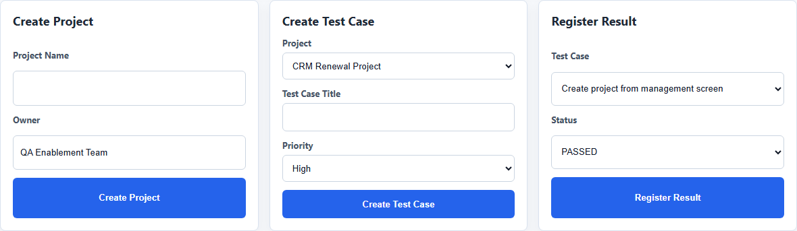
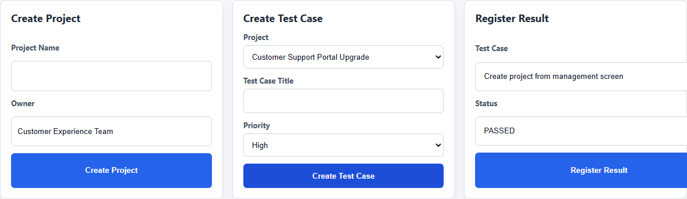
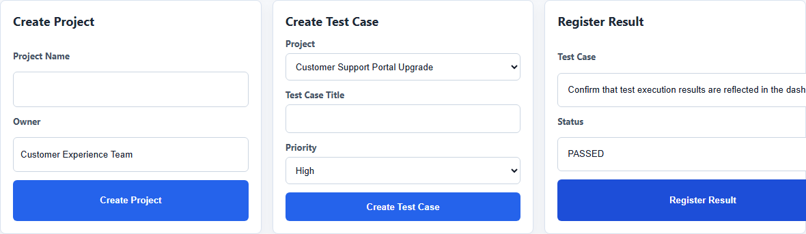
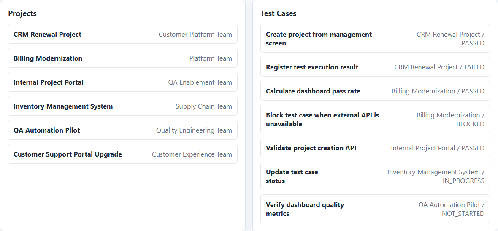
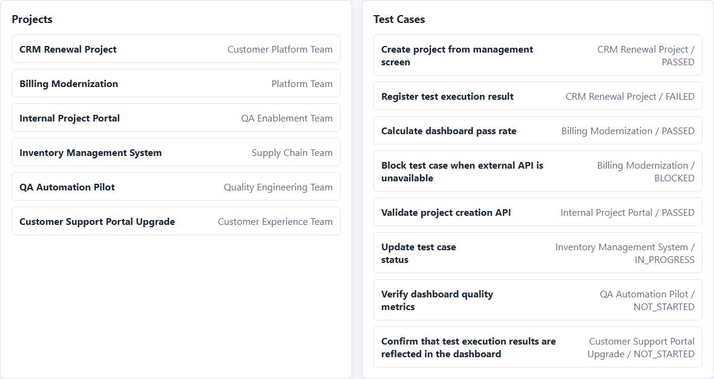
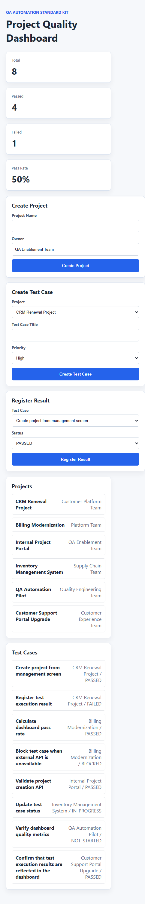
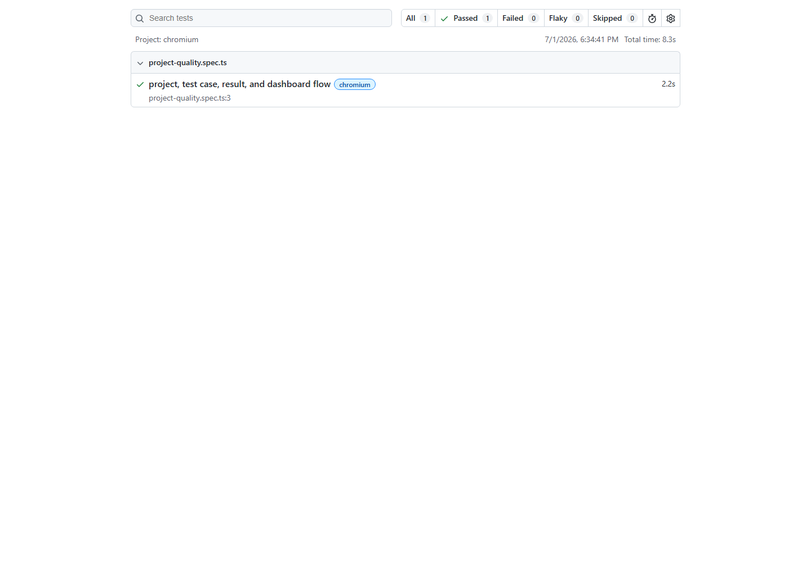
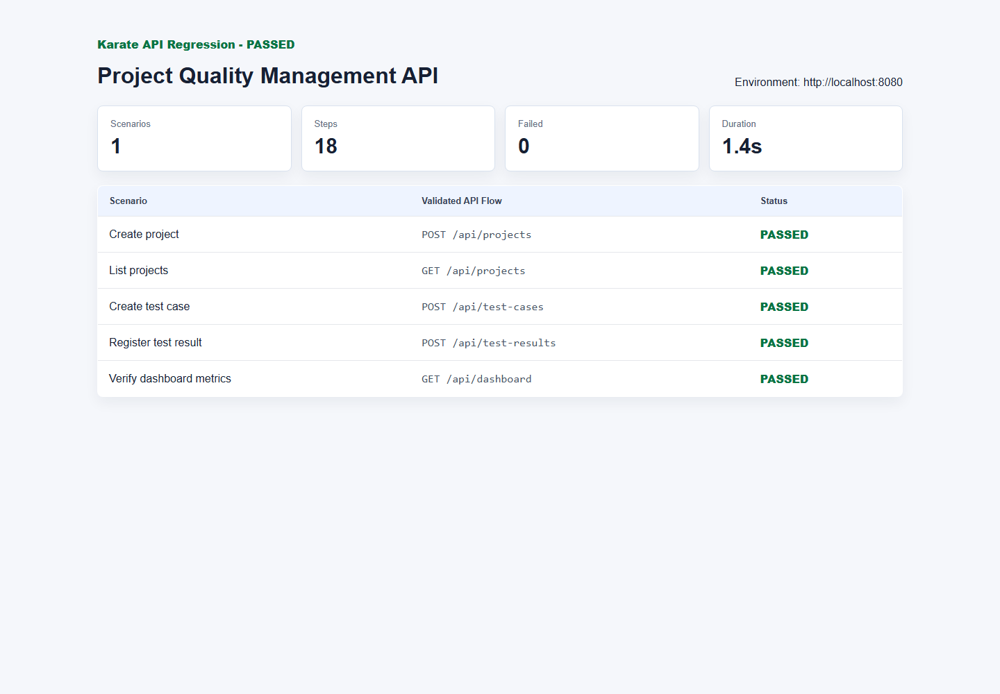

# QA Automation Standard Kit

[](https://github.com/seki999/qa-automation-standard-kit/actions/workflows/ci.yml)

This repository is a practical QA automation starter kit designed for cross-project adoption in enterprise internal systems.

It demonstrates not only how to implement automated tests, but also how to standardize test automation practices across multiple development teams using JUnit, Mockito, Spring Boot Test, Karate, Postman, Playwright, Selenium, Docker, and GitHub Actions.

本プロジェクトは、複数の社内プロジェクトへ横断的に導入できるテスト自動化スターターキットです。

単体テスト、結合テスト、APIテスト、E2Eテストを一つのサンプル構成として整理し、CI/CD、テストレポート、標準化ドキュメントまで含めることで、テスト自動化の導入支援、標準化、運用定着を想定しています。

## Project Overview

`qa-automation-standard-kit` は、社内プロジェクト管理・品質管理を想定した小規模Webアプリと、その周辺に必要なテスト自動化資産をまとめたポートフォリオプロジェクトです。

採用担当者や現場リーダーがREADMEだけを見ても、以下のスキルが伝わる構成にしています。

- テスト自動化の導入設計
- テスト環境構築
- ツール選定と使い分け
- Unit / Integration / API / E2E の責務分担
- CI/CD上での自動テスト実行
- テスト結果レポートの活用
- 開発チーム向けナレッジ共有と標準化資料の整備

## Mapping to Job Requirements

| Job Requirement | This Project |
| --- | --- |
| テスト自動化の導入支援 | Backend、Frontend、API、E2Eを含む再利用可能なスターターキットを提供 |
| テスト自動化の設計 | テストレベル、責務分担、自動化範囲、CI実行方針をREADMEとdocsで定義 |
| 環境構築 | Dockerfile、docker-compose、H2 Database、GitHub Actions workflowを整備 |
| ツール選定 | JUnit、Mockito、Spring Boot Test、Karate、Postman、Playwright、Seleniumの用途を整理 |
| JUnitによる単体テスト | JUnit 5 / Mockito によるService層テストを実装 |
| 結合テスト | Spring Boot Test、MockMvc、DataJpaTestでController / Repositoryを検証 |
| APIテスト | Karate API test と Postman Collection を提供 |
| E2Eテスト | Playwright と Selenium WebDriver で主要ユーザーフローを検証 |
| 標準化・ガイドライン整備 | test automation guideline、test strategy、tool selection、onboarding guideを作成 |
| CI/CDでの自動実行 | GitHub ActionsでBackend test、Karate、Frontend build、Playwright、Seleniumを実行 |
| ナレッジ共有 | docs配下に開発チーム向け導入手順、レビュー観点、調査手順を整理 |
| 複数プロジェクトへの横断展開 | 導入ステップ、flaky test対策、テストデータ方針を標準化資料として記載 |

## Application Screenshots

業務向けに自然なサンプルデータを使い、社内プロジェクト管理・品質管理のイメージが伝わる画面にしています。

### Dashboard Overview


### Project Management



### Test Case Management



### Test Result Registration



### Projects List



### Test Cases List



### Responsive View



## CI/CD Automation

GitHub Actionsでは、Pull Requestやpush時に自動テストとビルドを実行します。README上部のActions badgeは、最新workflowの状態を示します。

Workflow: [.github/workflows/ci.yml](.github/workflows/ci.yml)

CIで実行している内容:

- Backend unit test: JUnit 5 / Mockito
- Backend integration test: Spring Boot Test / MockMvc / DataJpaTest
- Karate API test: REST APIの主要業務フローを検証
- Frontend build: TypeScript / React / Vite build
- Playwright E2E test: 画面操作による主要フロー検証
- Selenium E2E test: Selenium WebDriverによるブラウザ自動化サンプル
- Test report upload: Surefire、Karate、Playwright reportをartifactとして保存

## Test Reports

### Playwright E2E Test Report

This project includes Playwright E2E tests to verify user flows such as project creation, test case registration, test result update, and dashboard metric validation.

The HTML report helps development teams quickly understand which scenario failed and why.

実行コマンド:

```bash
cd tests/playwright
npm install
npx playwright install chromium
npm test
npm run report
```

確認している観点:

- プロジェクトを画面から作成できること
- テストケースを画面から登録できること
- テスト結果登録によりステータスが更新されること
- ダッシュボードの品質メトリクスが表示されること



### Karate API Test Report

Karate is used to validate REST API behavior from a black-box testing perspective.
It is suitable for standardizing API regression tests across multiple internal projects.

実行コマンド:

```bash
cd tests/karate
mvn test -DbaseUrl=http://localhost:8080
```

確認している観点:

- プロジェクト登録APIが期待通りに動くこと
- プロジェクト一覧取得APIが登録結果を返すこと
- テストケース登録APIがプロジェクトに紐づくこと
- テスト結果登録APIがステータスを更新すること
- ダッシュボードAPIが品質メトリクスを返すこと

レポート出力先:

```text
tests/karate/target/karate-reports
```



## Directory Structure

```text
qa-automation-standard-kit/
  backend/                 # Java 17 / Spring Boot 3 REST API
  frontend/                # TypeScript / React / Vite UI
  tests/
    karate/                # Karate API test
    postman/               # Postman collection
    playwright/            # Playwright E2E test
    selenium/              # Selenium WebDriver sample
  docs/                    # Standardization and onboarding documents
  .github/workflows/       # GitHub Actions CI
  docker-compose.yml
  run-local-tests.ps1
```

## Technology Stack

| Area | Technology |
| --- | --- |
| Backend | Java 17, Spring Boot 3, Spring Web, Spring Validation, Spring Data JPA, H2, Maven |
| Frontend | TypeScript, React, Vite, Axios |
| Unit Test | JUnit 5, Mockito |
| Integration Test | Spring Boot Test, MockMvc, DataJpaTest |
| API Test | Karate, Postman Collection |
| E2E Test | Playwright, Selenium WebDriver |
| DevOps | Docker, docker-compose, GitHub Actions |

## Application Features

- プロジェクト一覧表示
- プロジェクト登録、更新、削除
- テストケース一覧表示
- テストケース登録、更新、削除
- テスト実行結果登録
- テストステータス管理: `NOT_STARTED`, `IN_PROGRESS`, `PASSED`, `FAILED`, `BLOCKED`
- ダッシュボード: 総テストケース数、成功件数、失敗件数、成功率

## API Specification

| Method | Endpoint | Description |
| --- | --- | --- |
| GET | `/api/projects` | プロジェクト一覧取得 |
| POST | `/api/projects` | プロジェクト登録 |
| PUT | `/api/projects/{id}` | プロジェクト更新 |
| DELETE | `/api/projects/{id}` | プロジェクト削除 |
| GET | `/api/test-cases` | テストケース一覧取得 |
| POST | `/api/test-cases` | テストケース登録 |
| PUT | `/api/test-cases/{id}` | テストケース更新 |
| DELETE | `/api/test-cases/{id}` | テストケース削除 |
| GET | `/api/test-results` | テスト結果一覧取得 |
| POST | `/api/test-results` | テスト結果登録。対象テストケースのステータスも更新 |
| GET | `/api/dashboard` | 品質ダッシュボード取得 |

Request example:

```bash
curl -X POST http://localhost:8080/api/projects \
  -H "Content-Type: application/json" \
  -d '{"name":"CRM Renewal Project","owner":"Customer Platform Team","startDate":"2026-07-01"}'
```

## Test Automation Architecture

| Test Level | Main Target | Purpose | Location |
| --- | --- | --- | --- |
| Unit | Service | 分岐、例外、ドメイン判断を高速に検証 | `backend/src/test` |
| Integration | Repository / Controller | JPA、Validation、HTTP I/O、JSON契約を検証 | `backend/src/test` |
| API | REST API | UIに依存しない業務フローとAPI契約を検証 | `tests/karate`, `tests/postman` |
| E2E | React UI | 利用者に近い主要シナリオを検証 | `tests/playwright`, `tests/selenium` |

## Tool Usage Policy

- JUnit 5: Javaテストの標準ランナー。単体・結合テストの土台。
- Mockito: Service層の依存をMock化し、業務ロジックを高速に確認。
- Spring Boot Test / MockMvc: Spring Context、Controller、Validation、JSONレスポンスを検証。
- Karate: APIシナリオをFeature形式で記述し、CIのAPI回帰テストに使用。
- Postman: 手動確認、API仕様共有、外部メンバーのオンボーディングに使用。
- Playwright: CIで安定しやすい主要E2E。トレース、スクリーンショット、HTMLレポートを活用。
- Selenium: 既存Selenium資産の移行・比較用サンプルとして保持。

## Local Setup

### Start with Docker

```bash
docker compose up --build
```

- Frontend: http://localhost:3000
- Backend API: http://localhost:8080
- H2 Console: http://localhost:8080/h2-console

### Start Backend and Frontend Separately

```bash
cd backend
mvn spring-boot:run
```

```bash
cd frontend
npm install
npm run dev
```

- Frontend: http://localhost:5173
- Backend: http://localhost:8080

## Test Execution

### Backend Unit / Integration

```bash
cd backend
mvn test
```

Report: `backend/target/surefire-reports`

### Karate API Test

```bash
cd tests/karate
mvn test -DbaseUrl=http://localhost:8080
```

Report: `tests/karate/target/karate-reports`

### Postman Collection

```bash
newman run tests/postman/qa-automation-standard-kit.postman_collection.json
```

### Playwright E2E

```bash
cd tests/playwright
npm install
npx playwright install chromium
npm test
```

Report: `tests/playwright/playwright-report`

### Selenium E2E

```bash
cd tests/selenium
npm install
npm test
```

### Local Test Helper

```powershell
.\run-local-tests.ps1
```

E2Eを省略する場合:

```powershell
.\run-local-tests.ps1 -SkipE2E
```

## Standardization Documents

- [Test Automation Guideline](docs/test-automation-guideline.md): 自動化対象の選定基準、テストピラミッド、命名規則、flaky test対策、レビュー観点を整理。
- [Test Strategy](docs/test-strategy.md): テスト目的、範囲、品質基準、自動化対象、手動テスト対象、リスク対策を整理。
- [Tool Selection](docs/tool-selection.md): JUnit、Mockito、Spring Boot Test、Karate、Postman、Playwright、Seleniumの用途と採用理由を比較。
- [Onboarding Guide](docs/onboarding-guide.md): 新規・既存プロジェクトへの導入手順、メンバー教育、PR確認、CI失敗時の調査手順を整理。

## Cross-Project Adoption Steps

1. 対象プロジェクトの品質課題を棚卸しし、障害頻度、手戻り、リリース判定の詰まりを確認する。
2. テストピラミッドに沿って、Unitで守るロジック、Integrationで守る境界、APIで守る契約、E2Eで守る業務フローを分解する。
3. 既存CIにBackend test、API test、Frontend build、E2E smokeを段階的に追加する。
4. flaky testを隔離し、原因分類、リトライ方針、待機戦略、テストデータ初期化を標準化する。
5. PRテンプレートやレビュー観点に「自動テスト追加・更新の有無」を組み込む。
6. ダッシュボードやテストレポートをチームの定例で確認し、失敗を放置しない運用にする。

## Future Enhancements

- OpenAPI / Swagger UI の追加
- TestcontainersによるDB結合テスト
- JaCoCoによるカバレッジ可視化
- NewmanのCI実行追加
- Allure Report連携
- 認証・権限を含むE2Eシナリオ
- 複数ブラウザ、モバイルviewportのPlaywright matrix
- SlackやTeamsへのCI失敗通知
